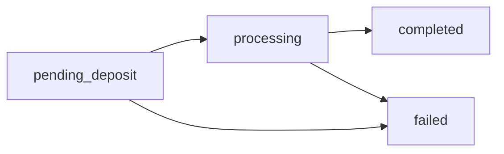

## Overview

Retrieve the current status and details of a bridge session.

## Path Parameters

<ParamField path="sessionId" type="string" required>
  The unique session ID returned when creating the bridge request
</ParamField>

## Response

<ResponseField name="sessionId" type="string">
  The unique session identifier
</ResponseField>

<ResponseField name="status" type="string">
  Current status of the bridge:
  - `pending_deposit`: Waiting for USDT deposit
  - `processing`: USDT received, executing bridge
  - `completed`: Bridge successful
  - `failed`: Bridge failed (check error field)
</ResponseField>

<ResponseField name="sourceChain" type="string">
  Source blockchain network
</ResponseField>

<ResponseField name="destinationChain" type="string">
  Destination blockchain network
</ResponseField>

<ResponseField name="amountUSDT" type="string">
  Amount of USDT being bridged
</ResponseField>

<ResponseField name="destinationWallet" type="string">
  Wallet address receiving USDT on destination chain
</ResponseField>

<ResponseField name="depositAddress" type="string">
  Address where USDT should be sent
</ResponseField>

<ResponseField name="createdAt" type="string">
  ISO timestamp when the session was created
</ResponseField>

<ResponseField name="txHash" type="string">
  Transaction hash (only present when status is `completed`)
</ResponseField>

<ResponseField name="explorerUrl" type="string">
  Block explorer URL for the transaction (only when completed)
</ResponseField>

<ResponseField name="layerZeroUrl" type="string">
  LayerZero scan URL for tracking cross-chain message (only when completed)
</ResponseField>

<ResponseField name="error" type="string">
  Error message (only present when status is `failed`)
</ResponseField>

<RequestExample>

```bash cURL
curl https://stable-flow-backend.onrender.com/bridge/status/bridge_1737638400000_abc123def
```

```javascript JavaScript
const sessionId = 'bridge_1737638400000_abc123def';
const response = await fetch(`https://stable-flow-backend.onrender.com/bridge/status/${sessionId}`);
const status = await response.json();
console.log(status);
```

```python Python
import requests

session_id = 'bridge_1737638400000_abc123def'
response = requests.get(f'https://stable-flow-backend.onrender.com/bridge/status/{session_id}')
print(response.json())
```

</RequestExample>

<ResponseExample>

```json Pending Deposit
{
  "sessionId": "bridge_1737638400000_abc123def",
  "status": "pending_deposit",
  "sourceChain": "base-sepolia",
  "destinationChain": "sepolia",
  "amountUSDT": "10",
  "destinationWallet": "0x22890dfAeD0667723fcD66e34FfB853b4F81f6bd",
  "depositAddress": "0x1234567890abcdef1234567890abcdef12345678",
  "createdAt": "2025-01-23T10:30:00.000Z"
}
```

```json Processing
{
  "sessionId": "bridge_1737638400000_abc123def",
  "status": "processing",
  "sourceChain": "base-sepolia",
  "destinationChain": "sepolia",
  "amountUSDT": "10",
  "destinationWallet": "0x22890dfAeD0667723fcD66e34FfB853b4F81f6bd",
  "depositAddress": "0x1234567890abcdef1234567890abcdef12345678",
  "createdAt": "2025-01-23T10:30:00.000Z"
}
```

```json Completed
{
  "sessionId": "bridge_1737638400000_abc123def",
  "status": "completed",
  "sourceChain": "base-sepolia",
  "destinationChain": "sepolia",
  "amountUSDT": "10",
  "destinationWallet": "0x22890dfAeD0667723fcD66e34FfB853b4F81f6bd",
  "depositAddress": "0x1234567890abcdef1234567890abcdef12345678",
  "createdAt": "2025-01-23T10:30:00.000Z",
  "txHash": "0xabcdef1234567890abcdef1234567890abcdef1234567890abcdef1234567890",
  "explorerUrl": "https://sepolia.basescan.org/tx/0xabcdef1234567890abcdef1234567890abcdef1234567890abcdef1234567890",
  "layerZeroUrl": "https://testnet.layerzeroscan.com/tx/0xabcdef1234567890abcdef1234567890abcdef1234567890abcdef1234567890"
}
```

```json Failed
{
  "sessionId": "bridge_1737638400000_abc123def",
  "status": "failed",
  "sourceChain": "base-sepolia",
  "destinationChain": "sepolia",
  "amountUSDT": "10",
  "destinationWallet": "0x22890dfAeD0667723fcD66e34FfB853b4F81f6bd",
  "depositAddress": "0x1234567890abcdef1234567890abcdef12345678",
  "createdAt": "2025-01-23T10:30:00.000Z",
  "error": "Timeout waiting for USDT deposit"
}
```

```json Session Not Found
{
  "error": "Session not found"
}
```

</ResponseExample>

## Status Lifecycle



### pending_deposit
The session is waiting for USDT to be deposited to the smart wallet address. This is the initial state.

**What to do**: Send the exact amount of USDT to the deposit address on the source chain.

### processing
USDT has been detected and the bridge transaction is being executed. This includes:
- Funding the wallet with ETH for gas
- Approving USDT for the bridge contract
- Executing the LayerZero bridge transaction

**What to do**: Wait for the transaction to complete (usually 1-3 minutes).

### completed
The bridge transaction has been successfully executed and confirmed on-chain.

**What to do**: Check the explorer URLs to see your transaction. Your USDT should arrive on the destination chain shortly.

### failed
The bridge transaction failed or timed out.

**What to do**: Check the `error` field for details. Common issues:
- Timeout (no deposit within 20 minutes)
- Insufficient funding wallet balance
- Network issues

## Polling Recommendations

<Info>
  For real-time updates, poll this endpoint at reasonable intervals:
  - **During pending_deposit**: Every 10-15 seconds
  - **During processing**: Every 5 seconds
  - **After completion**: Stop polling
</Info>

### Example Polling Implementation

<CodeGroup>

```javascript JavaScript
async function waitForCompletion(sessionId, maxWaitTime = 1200000) {
  const startTime = Date.now();
  
  while (Date.now() - startTime < maxWaitTime) {
    const response = await fetch(`https://stable-flow-backend.onrender.com/bridge/status/${sessionId}`);
    const status = await response.json();
    
    console.log(`Status: ${status.status}`);
    
    if (status.status === 'completed') {
      console.log('Bridge completed!');
      console.log('TX Hash:', status.txHash);
      return status;
    }
    
    if (status.status === 'failed') {
      console.error('Bridge failed:', status.error);
      throw new Error(status.error);
    }
    
    // Wait before next poll
    await new Promise(resolve => setTimeout(resolve, 10000)); // 10 seconds
  }
  
  throw new Error('Timeout waiting for bridge completion');
}
```

```python Python
import time
import requests

def wait_for_completion(session_id, max_wait_time=1200):
    start_time = time.time()
    
    while time.time() - start_time < max_wait_time:
        response = requests.get(f'https://stable-flow-backend.onrender.com/bridge/status/{session_id}')
        status = response.json()
        
        print(f"Status: {status['status']}")
        
        if status['status'] == 'completed':
            print('Bridge completed!')
            print(f"TX Hash: {status['txHash']}")
            return status
        
        if status['status'] == 'failed':
            print(f"Bridge failed: {status['error']}")
            raise Exception(status['error'])
        
        time.sleep(10)  # Wait 10 seconds
    
    raise Exception('Timeout waiting for bridge completion')
```

</CodeGroup>

## Tracking on Block Explorers

When the status is `completed`, you can track your transaction using the provided URLs:

### Source Chain Explorer
View the bridge transaction on the source chain:
- **Base Sepolia**: `https://sepolia.basescan.org/tx/{txHash}`
- **Sepolia**: `https://sepolia.etherscan.io/tx/{txHash}`

### LayerZero Scanner
Track the cross-chain message:
- `https://testnet.layerzeroscan.com/tx/{txHash}`

<Tip>
  The LayerZero scanner shows the complete journey of your cross-chain message, including when it's received on the destination chain.
</Tip>

## Common Status Transitions

| From | To | Typical Time | Notes |
|------|-----|--------------|-------|
| pending_deposit | processing | Varies | Depends on when user sends USDT |
| processing | completed | 1-3 minutes | Includes gas funding and bridge execution |
| pending_deposit | failed | 20 minutes | Timeout if no deposit |
| processing | failed | <1 minute | Usually due to insufficient funds or network issues |