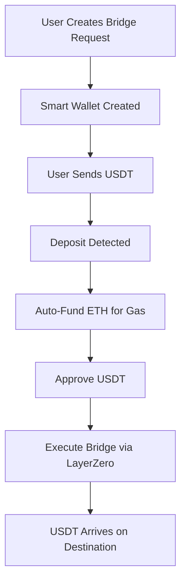

## Architecture Overview

The Smart Wallet Bridge uses a combination of technologies to enable seamless cross-chain transfers:



## Key Components

### 1. Smart Wallet Creation

Each bridge request creates a unique ERC-4337 smart wallet using Coinbase CDP SDK:

```typescript
async function createSmartWallet(cdp: CdpClient) {
  const owner = await cdp.evm.createAccount();
  const smartAccount = await cdp.evm.createSmartAccount({ owner });

  return {
    owner,
    smartAccount,
    ownerAddress: owner.address,
    smartWalletAddress: smartAccount.address,
    depositAddress: smartAccount.address,
  };
}
```

<Note>
  The smart wallet is controlled by a temporary owner account, ensuring security and isolation for each transaction.
</Note>

### 2. Deposit Monitoring

The system continuously monitors for USDT deposits:

```typescript
// Polls every 5 seconds for up to 20 minutes
while (attempts < maxAttempts) {
  const usdtBalance = await checkUSDTBalance(
    session.depositAddress,
    session.sourceChain
  );

  if (usdtBalance >= amount) {
    // Proceed with bridge
    break;
  }

  await new Promise(resolve => setTimeout(resolve, 5000));
  attempts++;
}
```

### 3. Automatic Gas Funding

When USDT is detected, the system automatically funds the smart wallet with ETH:

<Steps>
  <Step title="Calculate Required ETH">
    Estimates gas costs for the bridge transaction plus LayerZero fees
    ```typescript
    const estimatedGas = 500000n; // Conservative estimate
    const estimatedGasCost = estimatedGas * gasPrice;
    const requiredETH = (quote.lzFee + estimatedGasCost) * 2n; // 100% safety margin
    ```
  </Step>
  
  <Step title="Fund from Funding Wallet">
    Transfers ETH from the configured funding wallet
    ```typescript
    await fundSmartWalletWithETH(
      smartWalletAddress,
      sourceChain,
      requiredETH
    );
    ```
  </Step>
  
  <Step title="Wait for Confirmation">
    Ensures ETH balance is updated before proceeding
    ```typescript
    await waitForETHBalance(
      depositAddress,
      sourceChain,
      requiredETH,
      90 // 3 minutes timeout
    );
    ```
  </Step>
</Steps>

### 4. Bridge Execution

The bridge transaction is executed as a UserOperation:

```typescript
await cdp.evm.sendUserOperation({
  smartAccount: walletInfo.smartAccount,
  network: CDP_NETWORK_NAMES[sourceChain],
  calls: [
    {
      // Approve USDT for bridge contract
      to: usdtAddress,
      value: 0n,
      data: approveData,
    },
    {
      // Execute bridge with LayerZero fee
      to: bridgeAddress,
      value: lzFee,
      data: bridgeData,
    },
  ],
});
```

<Info>
  The UserOperation batches both the approve and bridge calls into a single atomic transaction.
</Info>

## Network Configuration

### Supported Networks

<CardGroup cols={2}>
  <Card title="Ethereum Sepolia" icon="ethereum">
    **Chain ID**: 11155111  
    **EID**: 40161  
    **USDT**: `0x21dE5De8A2b4A7c0f8198ac240403Af7d093179e`  
    **Bridge**: `0xcCDaC15b8E7C4Aa44b12B3acA6D8469B7a9F970a`
  </Card>
  
  <Card title="Base Sepolia" icon="layer-group">
    **Chain ID**: 84532  
    **EID**: 40245  
    **USDT**: `0xFB8C2026977FB4f580D0021D76843325e724Fa04`  
    **Bridge**: `0x41fFA79190fF1B2127FBf31B359B64392a026C58`
  </Card>
</CardGroup>

## Fee Structure

When bridging USDT, users pay several types of fees:

<AccordionGroup>
  <Accordion title="LayerZero Fee" icon="network-wired">
    Paid in ETH to LayerZero for cross-chain messaging. This fee is dynamically calculated based on gas prices and message size.
  </Accordion>
  
  <Accordion title="LP Fee" icon="coins">
    Liquidity provider fee, deducted from the USDT amount being bridged.
  </Accordion>
  
  <Accordion title="Protocol Fee" icon="building-columns">
    Small protocol fee deducted from the USDT amount.
  </Accordion>
  
  <Accordion title="Gas Costs" icon="gas-pump">
    Automatically funded by the system - users don't need to worry about this!
  </Accordion>
</AccordionGroup>

### Fee Quote Example

```typescript
const quote = await getBridgeQuote(
  sourceChain,
  destChain,
  parseUnits("100", 6) // 100 USDT
);

console.log({
  lzFee: formatUnits(quote.lzFee, 18) + " ETH",
  lpFee: formatUnits(quote.lpFee, 6) + " USDT",
  protocolFee: formatUnits(quote.protocolFee, 6) + " USDT",
  totalFee: formatUnits(quote.totalBridgeFee, 6) + " USDT",
  amountReceived: formatUnits(quote.amountToReceive, 6) + " USDT"
});
```

## Session Management

Bridge sessions are stored in-memory with the following lifecycle:

```typescript
interface BridgeSession {
  id: string;
  sourceChain: NetworkType;
  destinationChain: NetworkType;
  amountUSDT: string;
  destinationWallet: string;
  smartWalletAddress: string;
  depositAddress: string;
  status: "pending_deposit" | "processing" | "completed" | "failed";
  txHash?: string;
  error?: string;
  createdAt: Date;
  walletInfo: any;
}
```

<Warning>
  Sessions are stored in memory and will be lost if the server restarts. For production, implement persistent storage.
</Warning>

## Environment Variables

The server requires the following environment variables:

```bash
# Required: Private key for the funding wallet (without 0x prefix)
CUSTOMWALLET=your_private_key_here

# Optional: Server port (default: 3000)
PORT=3000

# Required by Coinbase CDP SDK
CDP_API_KEY_NAME=your_api_key_name
CDP_API_KEY_PRIVATE_KEY=your_api_private_key
```

<Tip>
  Make sure your funding wallet has sufficient ETH and USDT on both testnets for smooth operation.
</Tip>

## Security Considerations

<AccordionGroup>
  <Accordion title="Temporary Wallets" icon="shield-halved">
    Each bridge request creates a fresh smart wallet, ensuring isolation between transactions.
  </Accordion>
  
  <Accordion title="Private Key Security" icon="key">
    The funding wallet private key should be kept secure and never exposed. Use environment variables and secrets management.
  </Accordion>
  
  <Accordion title="Amount Validation" icon="circle-check">
    The system validates that the deposited amount matches the requested amount before executing the bridge.
  </Accordion>
  
  <Accordion title="Timeout Protection" icon="clock">
    Sessions timeout after 20 minutes of no deposit, preventing resource exhaustion.
  </Accordion>
</AccordionGroup>

## Error Handling

Common errors and their solutions:

| Error | Cause | Solution |
|-------|-------|----------|
| `Timeout waiting for USDT deposit` | No deposit within 20 minutes | Create a new bridge request |
| `Insufficient ETH after funding` | Funding wallet out of ETH | Top up the funding wallet |
| `Insufficient faucet balance` | Faucet ran out of USDT | Contact administrator to refill faucet |
| `Transaction failed: reverted` | Bridge contract issue | Check LayerZero status and retry |

## Next Steps

<CardGroup cols={2}>
  <Card
    title="API Reference"
    icon="code"
    href="/api-reference/introduction"
  >
    Explore detailed API documentation
  </Card>
  <Card
    title="GitHub Repository"
    icon="github"
    href="https://github.com/yourusername/bridge-api"
  >
    View the source code
  </Card>
</CardGroup>